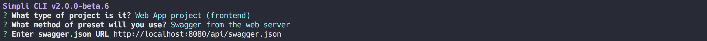
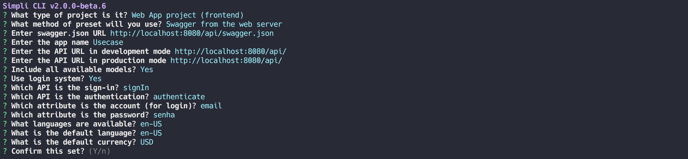
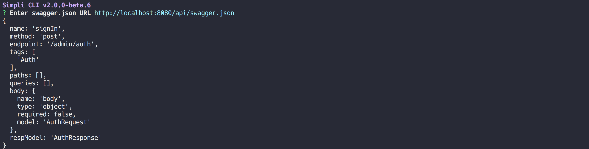

<p align="center">
  
  <br>
  <a href="https://www.npmjs.com/package/@simpli/cli"></a>
  <a href="https://www.npmjs.com/package/@simpli/cli"></a>
  <a href="https://www.npmjs.com/package/@simpli/cli"></a>
</p>

# Simpli CLI

* [About](#about)
* [Getting Started](#getting-started)
* [Commands](#commands)

## About
Simpli CLI provides tools to generate either web-server or web-client projects based on a MySQL database scheme.

---

### Server Project

> Client projects are generated based on your `MySQL database`, and it provides `Restful APIs`, including `Login API`.
Once you have built your server, you may use the `Docker`, `IntelliJ` or `NetBeans` in order to run your server.
I will assume you know how to use Tomcat Server and Maven.

#### Requirements
	- MVN CLI (Maven)
	- Docker CLI

or

	- MVN CLI (Maven)
	- Tomcat Server with Catalina
	- MySQL Server

#### Features included
	- Kotlin Language
	- Login API
	- API Router
	- API Process
	- MySQL Table Models
	- Data Access Object (DAO)
	- Persist Validation
	- Locale support (en-US and pt-BR included)
	- Preconfigured AWS Mail sender
	- Swagger Documentation
	- Unit Test

#### Structure
```
project-root/
    src/
        resource/
        main/
            kotlin/
                [module_name]/
                    auth/
                    context/
                    mail/
                    process/
                    request/
                    response/
                    router/
                    socket
                app/
                dao/
                enums/
                exception/
                locale/
                model/
                param/
                wrapper/
            webapp/
                META-INF/
                WEB-INF/
        test/
            kotlin/
                [module_name]/
                    auth/
                    process/
                model/
                    resource/
            resource/
                database/
                    create.sql
                    data.sql
```

---

### Client Project

> Client projects are generated based on `swagger.json` which can be found in server projects. It provides an interface with `CRUDs`, including `Login System`. Also, `Simpli Web SDK` supports you to easily develop your platform system. Access the [simpli-web-sdk documentation](https://github.com/simplitech/simpli-web-sdk) to further information.

#### Requirements
```
- Node.js with NPM
```

#### Features included
	- 100% Typescript
	- Login System
	- Simpli Web SDK
	- Serialized API responses into Models
	- Locale support (en-US and pt-BR included)
	- Persist Validation
	- Webpack with hot-reload
	- VUE CLI
	- VUE with Typescript
	- VUEX with Typescriptk
	- SPA (with VueRouter)
	- SCSS
	- ESLint

#### Structure
```
project-root/
    public/
        img/
        preloader/
    src/
        assets/
            font/
            img/
        components/
            modals/
        config/
        helpers/
            dialog/
            vuex/
        locale/
        model/
            collection/
            resource/
            request/
            response/
        schema/
        scss/
            components/
        setup/
        store/
            modules/
        types/
        views/
            auth/
            layouts/
            list/
            persist/
    /tests/
```

---

## Getting Started

Let's start by installing Simpli CLI globally with [npm](https://www.npmjs.com/).

```sh
$ npm install -g @simpli/cli
```

Once you have installed, simply go to your workspace directory and run the following:

```sh
$ simpli new:project [project-name]
```

You may now choose between `Server Project` and `Client Project`.

---

### Server Project Prompt

When you choose the `Server Project`, you have to provide your MySQL access with the chosen database:


Then, fill the rest of the prompt and confirm. Follow this example:


### Generating Fake Data

Another useful feature of Simpli CLI is `Fake Data`. This data can be found in `root-project/src/test/resources/database/data.sql`.
If you could not find it, go to the root of project and generate the `data.sql` by running `simpli new:seed`. Then run `simpli server:seed` to populate the fake data into your database.

> The default login is `test@test.com` and the password is `tester`

#### _Important_

Make sure your database is used for testing because the command `simpli server:seed` will TRUNCATE your tables.

#### Running the Server

Make sure the port 8080 is not in use.

Go to your project directory root and seed your database:

```sh
$ simpli server:seed
```

Then, run this shell:

```sh
$ sh build.sh
```

This command will use the `mvn` CLI and the `docker` CLI.
Therefore, it should have those installed.

Go to `localhost:8080`


Copy the swagger URL in order to generate the `Client Project`.

---

### Client Project Prompt

When you choose the `Client Project`, you have to provide the swagger URL found in your `Server Project`:



Then, fill the rest of the prompt and confirm. Follow this example:



Once you have generated the client, go to your project directory root and run:

```sh
$ npm run serve
```
to enter on `development mode`. Or run:
```sh
$ npm run build
```
to build for `production mode`.

When you enter on `dev`, you may see this screen at `localhost:8181`:


#### _Important_
> The password column of your login table must be encrypted by `double SHA-256`. E.g.: The password `123456` should be `49dc52e6bf2abe5ef6e2bb5b0f1ee2d765b922ae6cc8b95d39dc06c21c848f8c` in the password column.

---

## Commands

> Check it out the Simpli CLI commands

* [New Project](#new-project)
* [New Seed](#new-seed)
* [Scaffold Inspect](#scaffold-inspect)
* [Scaffold Sync](#scaffold-sync)
* [Server Inspect](#server-inspect)
* [Server Sync](#server-sync)
* [Server Seed](#server-seed)

---

### New Project

> Create a new simpli project

#### Usage

```sh
$ simpli new:project [options] <project-name>
```

```
<project-name> : The name of your root project directory
```

#### Options

```
-d, --default		skip prompts and use default preset
-f, --force		overwrite target directory if it exists
-h, --help		output usage information
```

---

### New Seed

> Create test data from a backend project and store it into data.sql

#### Usage

```sh
$ simpli new:seed
```

#### Options

```
-h, --help		output usage information
```

---

### Scaffold Inspect

> inspect the models and APIs based on swagger

#### Usage

```sh
$ simpli scaffold:inspect [options] [paths...]
```

```
[paths...] : The path of a model or API
```

#### Options

```
-h, --help		output usage information
```
#### Example

```sh
$ simpli scaffold:inspect api.signIn
```



---

### Scaffold Sync

> synchronize the models of the current frontend project based on its web server swagger

#### Usage

```sh
$ simpli scaffold:sync [options]
```

#### Options

```
-h, --help		output usage information
```

---

### Server Inspect

> inspect the tables of a MySQL database

#### Usage

```sh
$ simpli server:inspect [options] [paths...]
```

```
[paths...] : The path of a table
```

#### Options

```
-h, --help		output usage information
```
#### Example

```sh
$ simpli server:inspect table.user
```


---

### Server Sync

> synchronize the tables of the current backend project based on its MySQL database

#### Usage

```sh
$ simpli server:sync [options]
```

#### Options

```
-h, --help		output usage information
```

---

### Server Seed

> Seed the database with test data from the current backend project

Make sure your database is used for testing because the command `simpli server:seed` will TRUNCATE your tables.
Note: For security reasons, this command only allows MySQL host from `localhost`.

#### Usage

```sh
$ simpli server:seed
```

#### Options

```
-h, --help		output usage information
```

---

## Contributing

To run simpli-cli with your changes simply run this command:
```
node <simpli-cli-folder>/packages/@simpli/cli/bin/simpli.js <any-command> --debug
```
